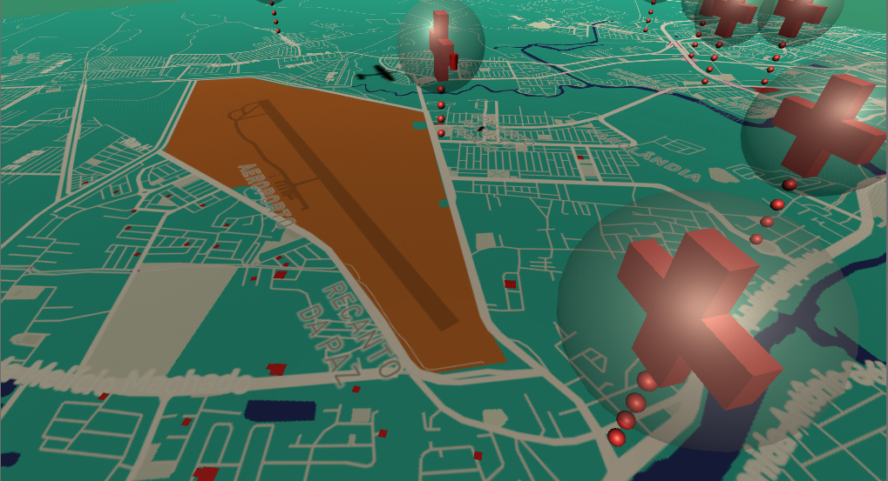
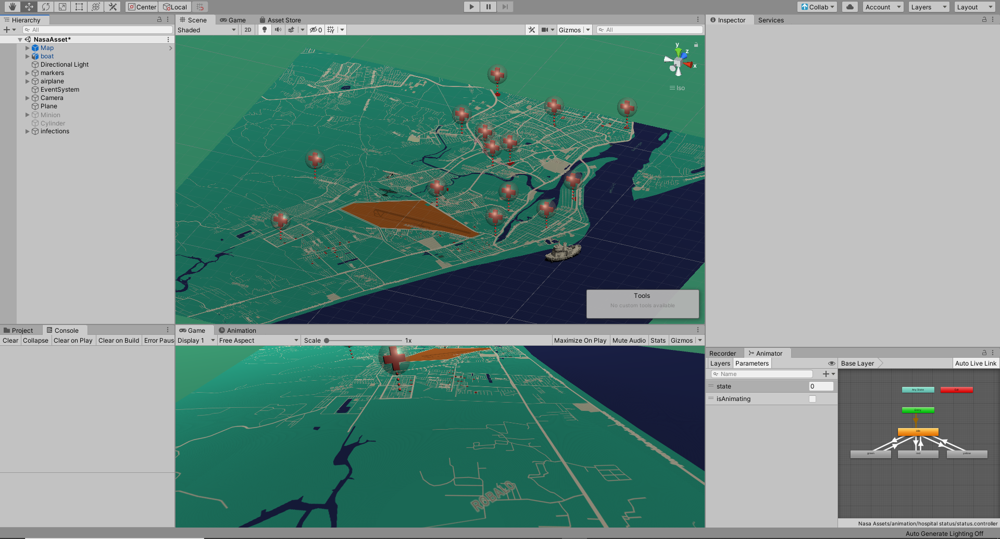
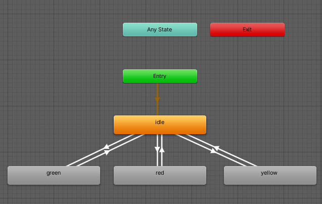

# Forseti-Nasa-SpaceApps
A map visualization for COVID-19.

**Link for the YouTube video: https://www.youtube.com/watch?v=xgyXrp9_tHs**

 Map from Aracaju/Sergipe, Brazil.

- Files with:
  - Programming
  - 3d objects
  - Prefabs and animations
- Please, look inside Nasa Assets folder.

- Screen and Animation Controller of the status bar.